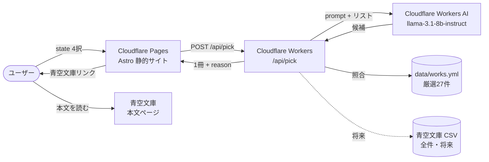
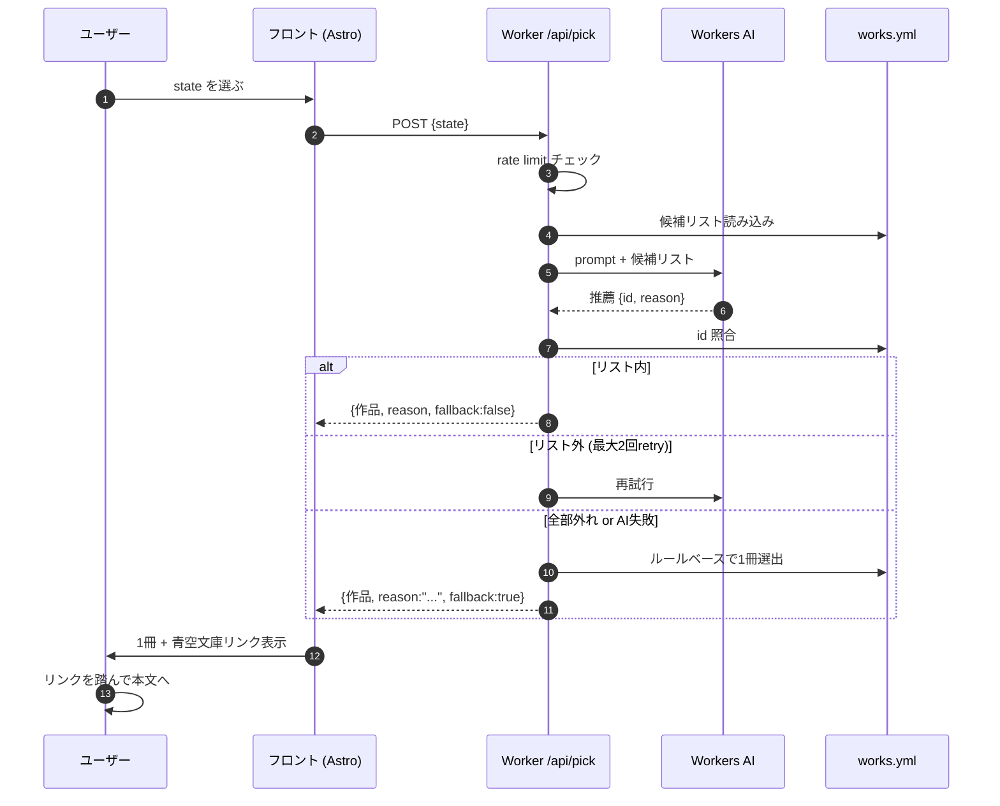

# Architecture

Aozora Reading Compass の全体像。個別の意思決定は [`adr/`](adr/INDEX.md) に、横断原則は [hagishun-handbook](https://github.com/hagishun/hagishun-handbook) に分離している。本ドキュメントはそれらを束ねた**見取り図**。

## 1枚で



主要コンポーネントは Cloudflare 1社に寄せている（[ADR-0003](adr/ADR-0003-tech-stack.md) / [free-tier-first](https://github.com/hagishun/hagishun-handbook/blob/main/principles/free-tier-first.md)）。本文は扱わず、青空文庫公式ページへのリンクのみで完結させる（[README](../README.md) の「やらないこと」）。

## データフロー（推薦1往復）



## データソースの役割分担

[ADR-0001](adr/ADR-0001-use-aozora-csv-for-grounding.md) で「実在リストでgroundingする」と決めた。実装上は2層持つ:

| 層 | ソース | 規模 | 役割 | 使用フェーズ |
|---|---|---|---|---|
| **L1: 厳選リスト** | `data/works.yml` | 27件 | 初手フォールバック / LLMコンテキストに同梱 | Phase 1〜 |
| **L2: 全件リスト** | 青空文庫公開CSV | 約18,000件 | 真のgrounding source。マイナー作品の候補化 | Phase 5+ |

Phase 1〜4 は L1 のみで動かす。L2 は ADR-0001 の最終形だが、CSV取得・整形パイプライン構築のコストが大きいので後回し。両者が揃った後も L1 は廃止せず、LLM応答が空・全リトライ失敗時の最終fallbackとして残す。

## graceful degradation の3段

無料枠で動かす前提（[free-tier-first](https://github.com/hagishun/hagishun-handbook/blob/main/principles/free-tier-first.md)）と、公開URLゆえの不確実性（[ADR-0002](adr/ADR-0002-serverless-llm-recommendation.md)）から、推薦経路は**必ず最後まで何かを返す**。

```
[正常] LLM応答 → リスト照合通過 → 表示
   ↓ 失敗
[再試行] LLM最大2回retry
   ↓ 全部外れ or タイムアウト
[fallback] works.yml から state一致でランダム1件
           reason は "今日は静かな一冊を" のような定型文
```

ユーザー体験上はどの段でも「1冊出る」。レスポンスに `fallback: bool` を含め、UI で「AIが選んだ」「リストから選びました」を区別する余地を残す。

## 無料枠の境界

| サービス | 無料枠 | 超えたら |
|---|---|---|
| Cloudflare Pages | 500 build/月、無制限リクエスト | ほぼ問題なし |
| Cloudflare Workers | 100,000 req/日 | 429返してfallback |
| Workers AI | 10,000 Neurons/日 | fallback層に落ちる |
| Cloudflare KV | 1,000 write/日, 100,000 read/日 | rate limit ストアを軽量化 |

LinkedIn 公開直後のバーストは Workers AI の Neurons を一番先に使い切る想定。fallback 層が機能していれば、ユーザー体験は劣化するが**サイトは止まらない**。

## やらないこと（この資料での再確認）

- 青空文庫本文の取得・キャッシュ・表示
- ユーザーアカウント・読書履歴のサーバー側保存（読了管理は手元の `reading-log.md` に閉じる）
- LLMが推薦した作品をリスト照合せずに表示すること
- 課金プランへの自動昇格

## 関連ドキュメント

- 実装順序: [`roadmap.md`](roadmap.md)
- 個別判断: [`adr/INDEX.md`](adr/INDEX.md)
- 横断原則: [hagishun-handbook/principles/](https://github.com/hagishun/hagishun-handbook/tree/main/principles)

## 改訂履歴

- 2026-05-05: 初版（ADR-0001/0002/0003 を1枚に束ねる）
