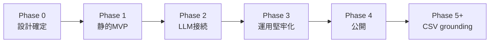

# Roadmap

実装の進む順序。**期限は書かない**（個人OSS実験のため）。各Phaseが「動くもの」を出すように区切る。

## 全体像

## Phase 0: 設計確定（完了）

- [x] README / works.yml / 読後ログテンプレート
- [x] ADR-0001 (CSV grounding 方針)
- [x] ADR-0002 (サーバーレス+LLM経路)
- [x] ADR-0003 (Astro + Cloudflare スタック)
- [x] handbook: llm-grounding / working-across-multiple-repos / free-tier-first
- [x] [`docs/architecture.md`](architecture.md)

## Phase 1: 静的MVP（LLM無し）

「state 選ぶ → works.yml から1冊 → 青空文庫リンク」だけが動く。

- Astro プロジェクトを scaffold（既存リポジトリに統合）
- works.yml を読み込んで型付け
- トップページ: state 4択 (recovery / thinking / stimulus / quiet)
- 結果ページ: state一致からランダム1件 + 青空文庫へのリンク
- Cloudflare Pages にデプロイ（mainブランチ自動デプロイ）
- 最低限のスタイル（読書テーマに合う静かなトーン）

**完了基準**: 公開URLで触れる。LLMはまだ呼ばない。

## Phase 2: LLM接続（Workers + Workers AI）

ADR-0002 の本丸。

- `functions/api/pick.ts`（または Workers ルート）を実装
- works.yml を Worker に同梱、prompt 組み立て
- Workers AI で `@cf/meta/llama-3.1-8b-instruct` 呼び出し
- 応答を works.yml に照合、リスト外なら最大2回retry
- 全失敗時はルールベースfallback、`fallback: true` を返す
- フロントから `/api/pick` を叩いて表示
- `reason`（LLM生成の3行コメント）を結果ページに表示

**完了基準**: 「state を選ぶたびに違う作品 + AI生成の理由」が出る。

## Phase 3: 運用堅牢化

公開直前の地雷つぶし。ここが学びの本丸（[ADR-0002](adr/ADR-0002-serverless-llm-recommendation.md) の動機）。

- Rate limit: Cloudflare KV または Rate Limiting API（IP単位、日次クォータ）
- タイムアウト: LLM 5秒で諦めて fallback
- エラーUI: 429 / 500 / fallback時の見え方
- 観測: Workers Analytics で叩かれ方を眺める
- LLMプロバイダ抽象化レイヤー（後で Gemini / Groq に差し替え可能に）
- README / architecture.md の更新（実装後に判明した制約を追記）

**完了基準**: 1日1000回叩かれても落ちない / クレカ請求が来ない。

## Phase 4: 公開

- LinkedIn 投稿（プロジェクトの主題 + 学んだこと + URL）
- Issue/Discussion をオープン
- スクショ・短いデモGIF撮影
- 「やらないこと」と無料枠の話を訴求点に組み込む

**完了基準**: 読者から1件でもフィードバックが届く。

## Phase 5+: 青空文庫CSV連携（ADR-0001 完全実現）

- `list_person_all_extended_utf8.csv` の取得・整形パイプライン（GitHub Actions 月次）
- 全件（約18,000）を Worker から参照可能な形式に（KV / R2 / 静的JSON）
- L1 (works.yml) と L2 (CSV) の併用ロジック
- 「マイナー作品も推薦されうる」を実証する記事を書く

**完了基準**: works.yml に無い作品が推薦結果に出る瞬間を確認できる。

## やらないこと（ロードマップ上の明示）

- ユーザーアカウント・ログイン
- サーバー側の読書履歴保存
- 全文検索 / 本文表示
- ネイティブアプリ
- 月額課金プランの追加（[free-tier-first](https://github.com/hagishun/hagishun-handbook/blob/main/principles/free-tier-first.md) を破る判断は別ADRで）

## 改訂履歴

- 2026-05-05: 初版
